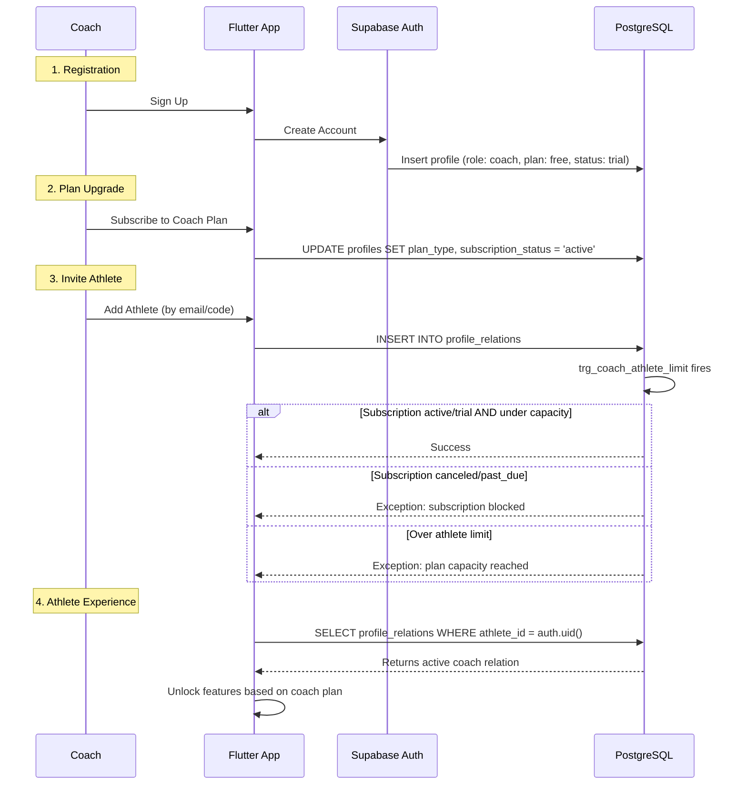

# Coach-Athlete Onboarding Flow

This document describes the complete lifecycle of a Coach managing Athletes within LiftSense, including how subscription status and plan limits are enforced at the database level.

## Flow Diagram



## Lifecycle Stages

### 1. Coach Registration
- Coach creates account via Supabase Auth.
- Profile is created with defaults: `role: coach`, `plan_type: free`, `subscription_status: trial`.
- During trial, the coach can test athlete linking features.

### 2. Plan Upgrade
- Coach selects a plan (`coach_starter`, `coach_pro`, `coach_elite`).
- Backend updates `plan_type` and sets `subscription_status: active`.
- Pricing reference:

| Plan    | Athletes  | Price (COP) |
| :------ | :-------- | :---------- |
| Starter | 5         | $49.000     |
| Pro     | 20        | $99.000     |
| Elite   | Unlimited | $179.000    |

### 3. Athlete Invitation
- Coach sends an invitation (email, QR, or unique code).
- A row is inserted into `profile_relations` with `status: active`.
- The database trigger `trg_coach_athlete_limit` validates:
  1. **Subscription Status**: Must be `active` or `trial`. Coaches with `canceled` or `past_due` are blocked.
  2. **Plan Capacity**: Starter ≤ 5, Pro ≤ 20, Elite = unlimited.

### 4. Athlete Experience

> **Key Concept**: The athlete's access level is **derived from the coach relationship**, not from their own `plan_type`.

- The athlete's personal `plan_type` remains `free`.
- The Flutter app checks `profile_relations` to determine if the athlete is linked to an active coach.
- If linked, the app **unlocks the same features** as if the athlete had paid for a `pro` subscription:
  - Full biomechanical analysis
  - Historical trend visualization
  - Priority processing
  - Session export
- If the coach cancels, existing relations remain (read-only access to historical data), but no new sessions can be created under the coach's umbrella.

### 5. Coach Cancellation
- `subscription_status` changes to `canceled`.
- **Existing relations persist** — athletes can still view their historical data.
- **New athlete links are blocked** by the trigger.
- If the coach reactivates, linking resumes immediately.

## Frontend Implementation Notes

The Flutter app must query `profile_relations` on login to determine athlete access:

```dart
// Pseudocode for feature gating
final relations = await supabase
  .from('profile_relations')
  .select('coach_id, status, permissions')
  .eq('athlete_id', currentUserId)
  .eq('status', 'active');

if (relations.isNotEmpty) {
  // Athlete is managed by a coach → unlock pro features
  enableProFeatures();
} else {
  // Check personal plan_type for feature gating
  checkPersonalPlan();
}
```
