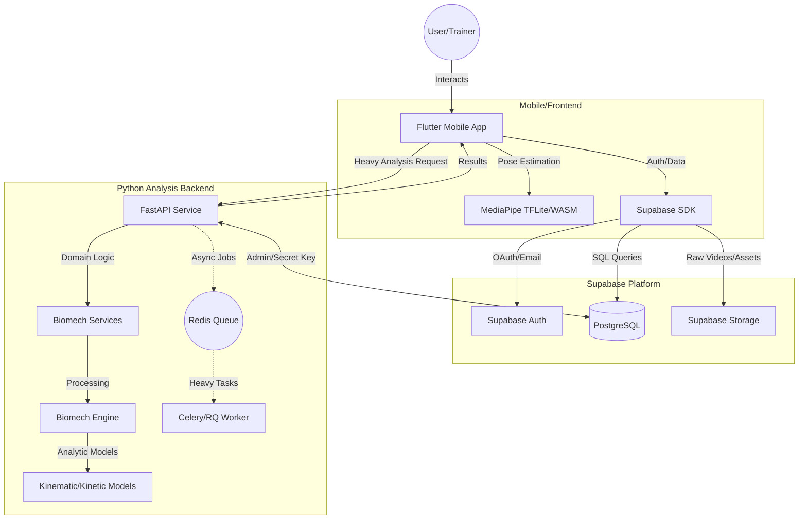

# System Architecture

The LiftSense system is designed for scalable, interpretable biomechanical analysis. It follows a decoupled architecture separating the mobile-first frontend, a Python-based backend specializing in biomechanics, and Supabase for infrastructure (authentication, database, and storage).

## High-Level Diagram

## Description of Components

### 1. Flutter Frontend
- **Responsibilities**: Video capture, real-time landmark visualization (MediaPipe), user session management, and dashboard visualization.
- **Technologies**: Flutter, MediaPipe, Supabase Flutter SDK.

### 2. Python Backend (FastAPI)
- **Responsibilities**: Complex biomechanical calculations (Inverse Kinematics, FFT, validation against lab data), multi-frame analysis, and session reporting.
- **Architectural Pattern**: Domain-Driven Design (DDD).
- **Technologies**: FastAPI, NumPy, SciPy, Pandas.

### 3. Supabase
- **Authentication**: Handles user signup, login, and role-based access (user, trainer, researcher).
- **PostgreSQL Database**: Stores user metadata, session details, landmarks, and calculated metrics.
- **Storage**: Holds raw video captures or uploaded files.

### 4. Biomech Engine
- A decoupled Python module that can be run independently of the API for batch processing or scientific validation.
