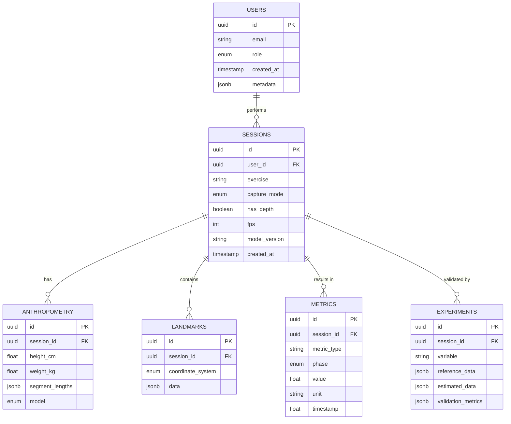

# Database ER Diagram

The database is built on PostgreSQL (Supabase) and follows a relational structure optimized for biomechanical time-series data and session management.

```mermaid
erDiagram
    USERS ||--o{ SESSIONS : "performs"
    USERS {
        uuid id PK
        string email
        enum role
        timestamp created_at
        jsonb metadata
    }

    SESSIONS ||--o{ ANTHROPOMETRY : "has"
    SESSIONS ||--o{ LANDMARKS : "contains"
    SESSIONS ||--o{ METRICS : "results in"
    SESSIONS ||--o{ EXPERIMENTS : "validated by"
    SESSIONS {
        uuid id PK
        uuid user_id FK
        string exercise
        enum capture_mode
        boolean has_depth
        int fps
        string model_version
        timestamp created_at
    }

    ANTHROPOMETRY {
        uuid id PK
        uuid session_id FK
        float height_cm
        float weight_kg
        jsonb segment_lengths
        enum model
    }

    LANDMARKS {
        uuid id PK
        uuid session_id FK
        enum coordinate_system
        jsonb data
    }

    METRICS {
        uuid id PK
        uuid session_id FK
        string metric_type
        enum phase
        float value
        string unit
        float timestamp
    }

    EXPERIMENTS {
        uuid id PK
        uuid session_id FK
        string variable
        jsonb reference_data
        jsonb estimated_data
        jsonb validation_metrics
    }
```
