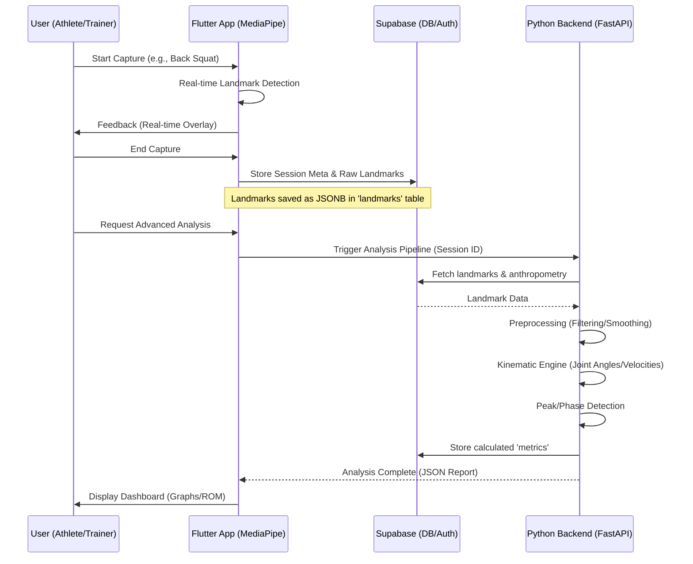

# Biomechanical Analysis Process Flow

This diagram illustrates the lifecycle of a biomechanical capture session, from video acquisition on the mobile device to final metric storage.

## Key Stages

1. **Acquisition**: MediaPipe runs locally on the edge for immediate feedback and privacy.
2. **Offloading**: Only extracted landmark data (not necessarily the full video) is pushed to Supabase to save bandwidth, unless "Lab" mode is selected.
3. **Refinement**: The Python backend applies scientific-grade signal processing (e.g., Butterworth filters, spline interpolation) that is too heavy or complex to implement reliably in cross-platform Dart.
4. **Insight**: Results are persisted in the `metrics` table for longitudinal progress tracking.
