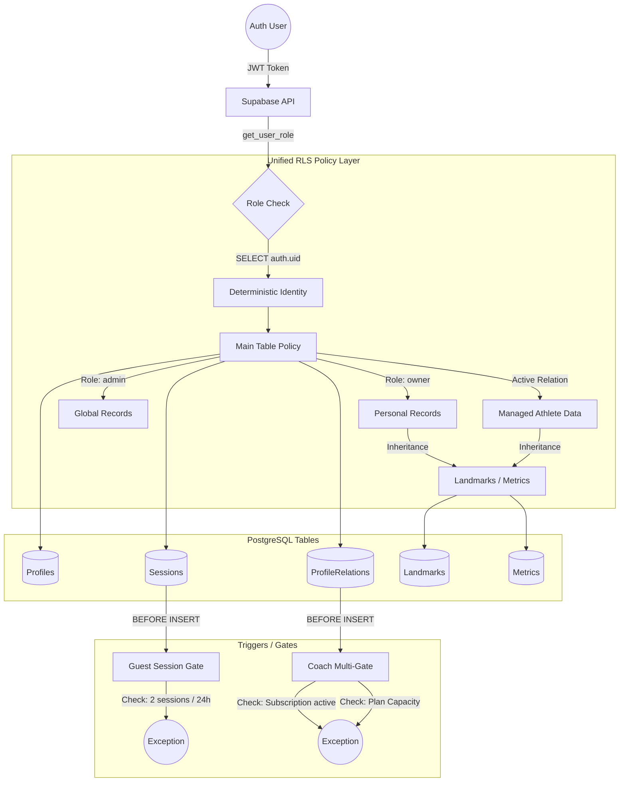

# RLS & Policy Architecture

This diagram illustrates how authentication, roles, and business rules (subscriptions/limits) intersect at the database layer to ensure data integrity and security.

## Detailed Policy Breakdown

| Table          | Policy Name             | Condition (Logic)                    | Purpose                                |
| :------------- | :---------------------- | :----------------------------------- | :------------------------------------- |
| **Profiles**   | `profiles_main_policy`  | `owner` OR `admin`                   | Self-management and admin oversight.   |
| **Sessions**   | `sessions_main_policy`  | `owner` OR `admin` OR `linked_coach` | Primary data access for analysis.      |
| **Anthro**     | `anthro_main_policy`    | `owner` OR `admin`                   | Biometric integrity.                   |
| **Relations**  | `relations_main_policy` | `coach` OR `athlete` OR `admin`      | Visibility of training partnerships.   |
| **Lndmk/Metr** | `landmarks_main_policy` | `inherited from session`             | Automated access for time-series data. |

### Performance & Security Notes

1.  **Deterministic Identity**: We use `(SELECT auth.uid())` in all policies. This prevents PostgreSQL from re-evaluating the `auth.uid()` function for every row in a scan, improving performance by orders of magnitude on large datasets (e.g., millions of landmarks).
2.  **Unified Action Pattern**: Using `FOR ALL` instead of separate `SELECT/INSERT/UPDATE` policies avoids the "Multiple Permissive Policies" lint error and simplifies the security surface area.
3.  **Trigger-Based Business Logic**: Hard limits (like the coach's athlete cap) are enforced via triggers rather than RLS. Triggers provide a robust "last line of defense" that cannot be bypassed by simply having the correct role.

For a deep dive into the exact SQL and security rationale, see the **[Detailed RLS Documentation](rls_policies_detailed.md)**.
