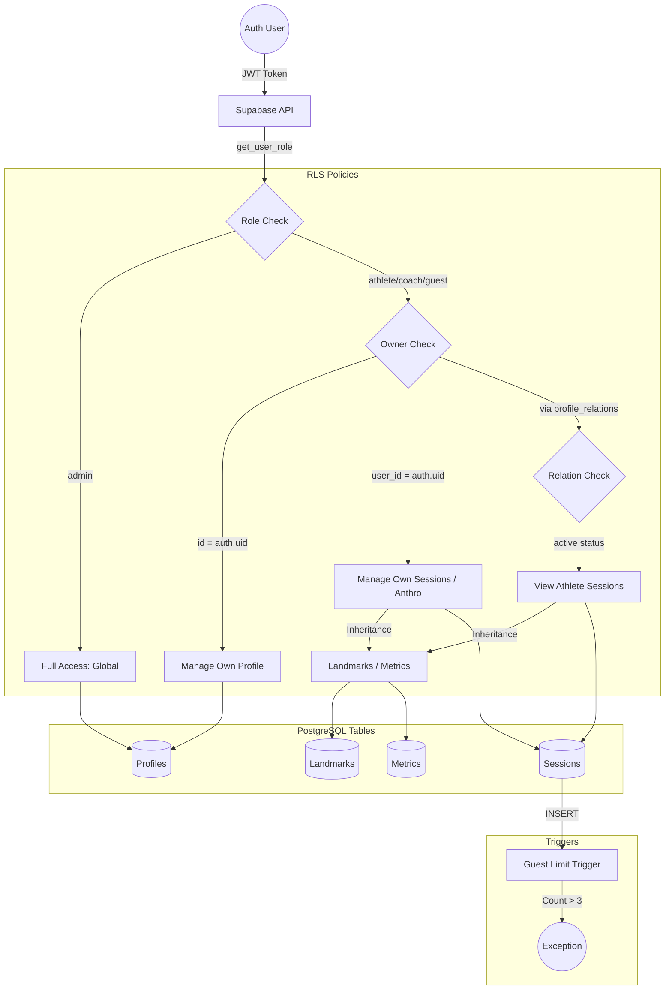

# RLS Logic Schematic

This diagram visualizes how authentication and roles flow through the database to grant or deny access.

## Policy Breakdown

| Table          | Logic                                | Role Dependency              |
| :------------- | :----------------------------------- | :--------------------------- |
| **Profiles**   | `owner` OR `admin`                   | Strict ID match              |
| **Sessions**   | `owner` OR `admin` OR `active coach` | Join via `profile_relations` |
| **Lndmk/Metr** | `inherited from session`             | `EXISTS` parent check        |
| **Anthro**     | `owner` OR `admin`                   | Linear history               |
