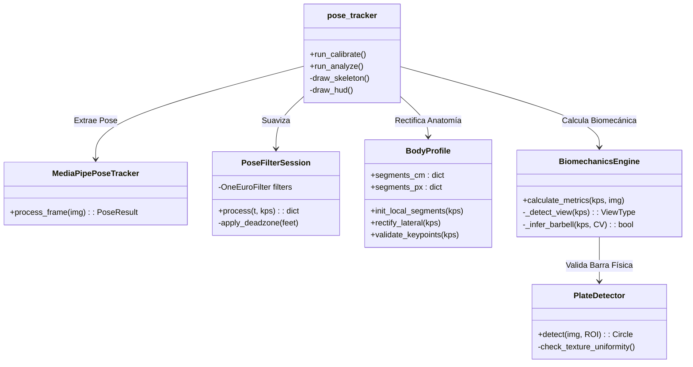
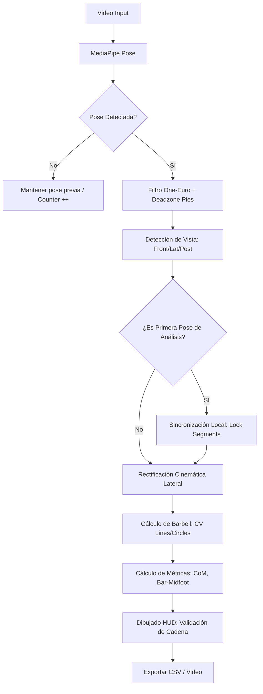

# 🧬 LiftSense Biomechanics Engine: Documentación Técnica v1.5

## 1. Visión General
El motor de LiftSense es un sistema de análisis biomecánico en tiempo real diseñado para la sentadilla. A diferencia de soluciones de fitness genéricas, LiftSense utiliza **Rectificación Cinemática Inversa** y **Sincronización de Perfil** para garantizar que los datos cumplan con el rigor anatómico necesario para el uso clínico.

## 2. Mapa de Estructura del Core (UML Conceptual)

## 3. Diagrama de Flujo: Pipeline de Precisión

## 4. Memorándum de Decisiones de Diseño (VSR - Vision Scalable Rigor)

Para alcanzar el nivel de precisión actual, se tomaron las siguientes decisiones fundamentales basadas en la observación de fallos comunes en MediaPipe:

### A. Rectificación Inversa (Anclaje al Tobillo)
- **Problema**: En una cadena Hombro -> Cadera -> Rodilla -> Tobillo, el error de ángulo se acumula hacia abajo, provocando que el pie "baile".
- **Decisión**: Invertir la rectificación para la pierna. El **Tobillo** es el ancla sagrada. La Rodilla se proyecta desde el Tobillo hacia arriba.
- **Resultado**: Estabilidad absoluta del pie y contacto con el suelo perfecto.

### B. Sincronización Local (Local-Frame Sync)
- **Problema**: El desfase de 1-2 cm en las articulaciones debido a cambios de perspectiva entre la calibración frontal y el análisis lateral.
- **Decisión**: En el primer frame de análisis, el sistema captura las proporciones que MediaPipe "entiende" en ese video específico y las bloquea.
- **Resultado**: Los puntos caen siempre en el centro visual de la articulación.

### C. Evidencia Física para Barra (True Barbell Mode)
- **Problema**: MediaPipe alucina una barra (falso positivo) si el usuario levanta las manos por equilibrio.
- **Decisión**: Deshabilitar la inferencia por pose. Solo se reporta barra si el detector de **Hough Circles** (discos) o **Hough Lines** (vara) confirma un objeto físico mediante visión clásica.
- **Resultado**: Éxito absoluto en distinguir sentadilla libre de sentadilla con peso.

### 3.3 Validación de Cadena Latente (Antropometría)
- **Problema**: Pies flotantes en el fondo del video sin conexión al cuerpo.
- **Decisión**: Lógica de "Todo o Nada". Si la cadera o rodilla de un lado no superan el 65% de confianza (falla la cadena cinemática), se oculta toda la pierna de ese lado.
- **Resultado**: Visualización limpia y profesional, centrada solo en los datos válidos.

### 3.4 Sincronización de Feedback Visual (Anti-Flicker)
- **Problema**: Detecciones erróneas en un solo frame (reflejos, plantas) que "parpadean" en el HUD.
- **Decisión**: La renderización de elementos visuales (círculos de discos, líneas) está sincronizada con el buffer de persistencia temporal. 
- **Resultado**: Solo se muestra el feedback si el sistema está seguro del objeto, eliminando distracciones visuales.

---
*Documentación Técnica Oficial de LiftSense Engine.*
