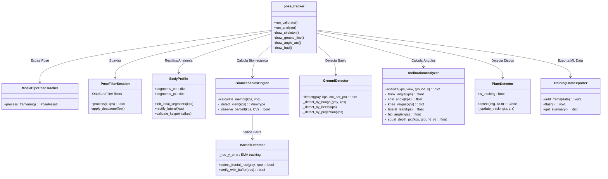
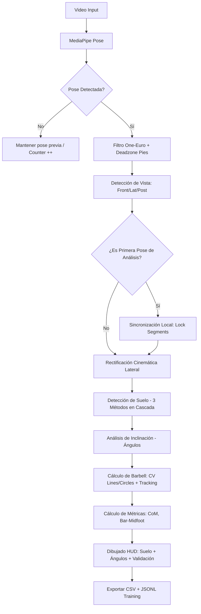

# 🧬 LiftSense Biomechanics Engine: Documentación Técnica v2.0

## 1. Visión General
El motor de LiftSense es un sistema de análisis biomecánico en tiempo real diseñado para la sentadilla. Utiliza **Rectificación Cinemática Inversa**, **Sincronización de Perfil**, **Detección del Plano del Suelo**, y **Análisis Angular** para garantizar datos con rigor anatómico para uso clínico.

## 2. Mapa de Estructura del Core (UML Conceptual)

## 3. Diagrama de Flujo: Pipeline de Precisión v2.0

## 4. Módulos Nuevos (v2.0)

### A. GroundDetector — Detección del Plano del Suelo
- **3 métodos en cascada**: Hough Lines → Heel Anchor → Torso Projection
- **Suavizado temporal**: EMA con α=0.15 para evitar saltos
- **Hough Lock**: Si la línea del piso es estable por 15+ frames, se bloquea
- **Anti-salto**: Cambios >50px reciben α=0.05 (máximo amortiguamiento)

### B. InclinationAnalyzer — Análisis Angular
- **Trunk angle**: Inclinación del tronco vs. vertical (0°=erguido, 90°=horizontal)
- **Shin angle**: Inclinación tibial (dorsiflexión del tobillo)
- **Knee valgus**: Desviación medial de la rodilla (vista frontal/posterior)
- **Lateral lean**: Desequilibrio lateral de caderas
- **Hip angle**: Ángulo shoulder-hip-knee (180°=extendido)
- **Squat depth**: Profundidad como % (0%=de pie, 100%=paralelo, >100%=profundo)
- **Good morning detection**: Derivada del trunk angle >5°/frame = alerta

### C. TrainingDataExporter — Datos para ML
- Formato JSONL: un registro JSON por línea por frame
- Incluye keypoints compactos, ground data, ángulos, biomecánica
- Campo `label: null` para etiquetado posterior
- Activado con `--mode export_training`

## 5. Memorándum de Decisiones de Diseño (VSR - Vision Scalable Rigor)

### A. Rectificación Inversa (Anclaje al Tobillo)
- **Problema**: En una cadena Hombro -> Cadera -> Rodilla -> Tobillo, el error de ángulo se acumula hacia abajo, provocando que el pie "baile".
- **Decisión**: Invertir la rectificación para la pierna. El **Tobillo** es el ancla sagrada. La Rodilla se proyecta desde el Tobillo hacia arriba.
- **Resultado**: Estabilidad absoluta del pie y contacto con el suelo perfecto.

### B. Sincronización Local (Local-Frame Sync)
- **Problema**: El desfase de 1-2 cm en las articulaciones debido a cambios de perspectiva entre la calibración frontal y el análisis lateral.
- **Decisión**: En el primer frame de análisis, el sistema captura las proporciones que MediaPipe "entiende" en ese video específico y las bloquea.
- **Resultado**: Los puntos caen siempre en el centro visual de la articulación.

### C. Evidencia Física para Barra (True Barbell Mode) — v2.0
- **Problema anterior**: Hough Lines/Circles saltaban a paredes y bordes entre frames, produciendo falsos positivos inestables.
- **Decisión v2.0**: 
  - **Coherencia Espacial**: EMA de posición de la barra, con rechazo de saltos >40px.
  - **Histéresis de estado**: 65% consenso para activar, <25% para desactivar.
  - **Proximidad a C7**: Las líneas deben estar cerca del centro de hombros.
  - **Tracking de discos**: ROI dinámico que se contrae cuando el disco está en seguimiento.
- **Resultado**: La barra no parpadea ni salta a objetos del fondo.

### D. Detección de Suelo por Cascada (v2.0)
- **Problema**: Asumir que el tobillo = suelo falla con cámaras inclinadas, plataformas, o alzas.
- **Decisión**: 3 métodos en cascada por confianza: Hough Lines físicas, ancla bilateral de talones, y proyección antropométrica.
- **Resultado**: Ground truth del suelo real para cálculos de profundidad y ángulos absolutos.

### E. Validación de Cadena Latente (Antropometría)
- **Problema**: Pies flotantes en el fondo del video sin conexión al cuerpo.
- **Decisión**: Lógica de "Todo o Nada". Si la cadera o rodilla de un lado no superan el 65% de confianza (falla la cadena cinemática), se oculta toda la pierna de ese lado.
- **Resultado**: Visualización limpia y profesional, centrada solo en los datos válidos.

### F. Sincronización de Feedback Visual (Anti-Flicker)
- **Problema**: Detecciones erróneas en un solo frame (reflejos, plantas) que "parpadean" en el HUD.
- **Decisión**: La renderización de elementos visuales (círculos de discos, líneas) está sincronizada con el buffer de persistencia temporal. 
- **Resultado**: Solo se muestra el feedback si el sistema está seguro del objeto, eliminando distracciones visuales.

---
*Documentación Técnica Oficial de LiftSense Engine v2.0*
